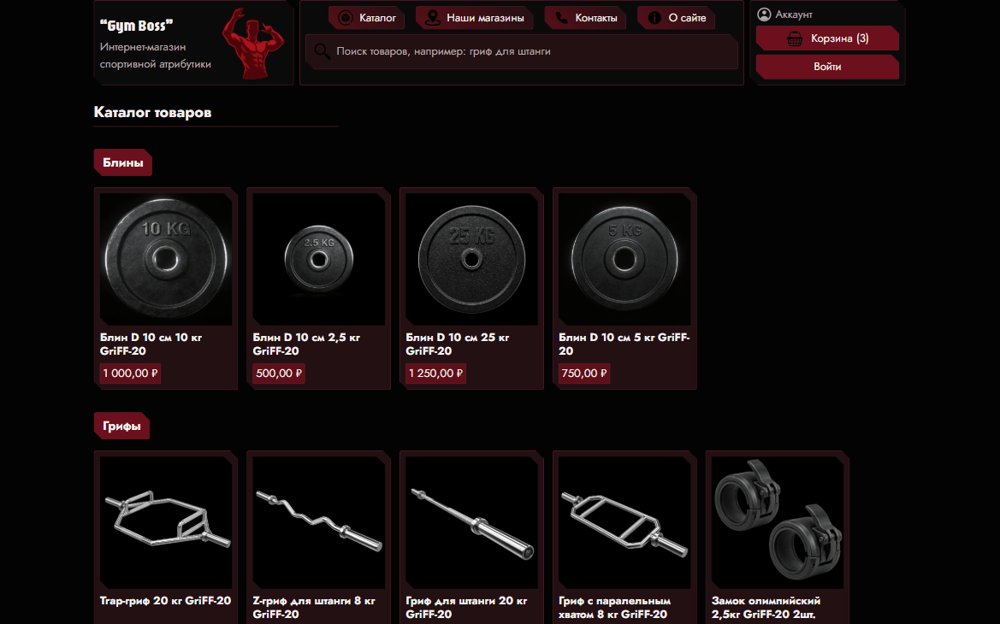
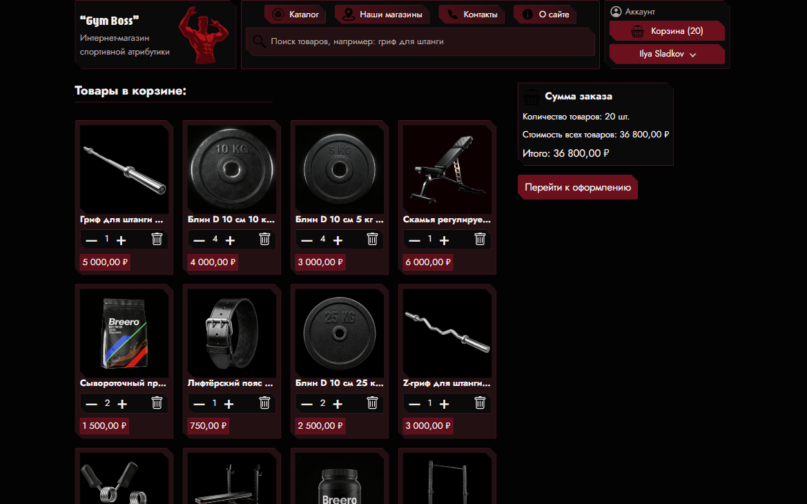
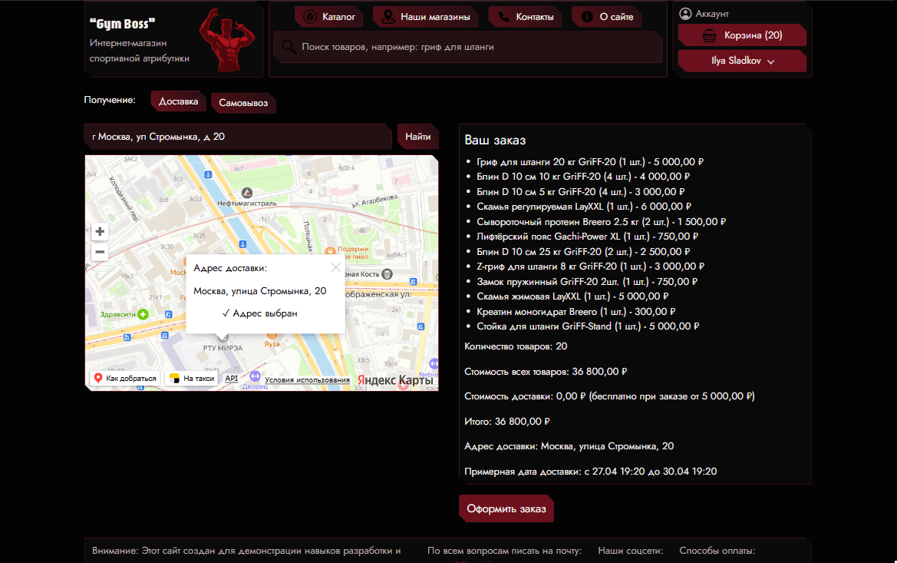
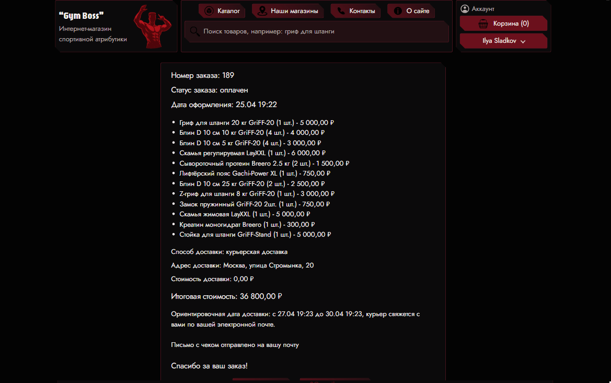

# GymBoss - Full-stack интернет-магазин

Учебный pet-project: интернет-магазин спортивных товаров, написанный с нуля на PHP и JS без фреймворков.
Проект прошёл полный рефакторинг из монолита независимых страниц в структурированное MPA на базе MVC.


[](https://gymboss.mocus8.ru/)

## Стек

**Backend:** PHP 8.2 (ООП), собственный MVC-фреймворк, роутер, front controller, DI, PSR-4, Composer
**Frontend:** vanilla JS (ES6+, модули), HTML5, CSS (адаптив)
**База данных:** MySQL 8 (схема, индексы, оптимизация запросов)
**Инфраструктура:** Nginx + PHP-FPM, Docker / Docker Compose (раздельные конфиги dev/prod), GitHub Actions (CI: lint, syntax check), HTTPS через Let's Encrypt (certbot, HTTP/2), автообновление сертификата и другие cron-задачи (db backups, sync payment statuses, generate sitemap, clean carts, clean login attempts), рабочее демо на VPS
**Внешние сервисы:** ЮKassa, Яндекс.Карты, DaData, Resend, Google reCAPTCHA v3
**VPS с демо:** Linux (Ubuntu 24.04), подключение к серверу через SSH и ключ

## Архитектура

Приложение - MPA на базе MVC с единой точкой входа через front controller.
Бизнес-логика разделена по доменам (Cart, Orders, Payments, Auth), каждый домен
содержит собственные сервисы и репозитории.

## Ссылка на демо проекта

Интернет-магазин GymBoss: https://gymboss.mocus8.ru/

## Скриншоты

<p align="center">
  
  &nbsp;
  
</p>

<p align="center">
  
  &nbsp;
  
</p>

**Основные паттерны и решения:**

- **Front controller + Router** - все запросы проходят через `public/index.php`
  и маршрутизируются на нужный контроллер
- **Repository pattern** - работа с БД инкапсулирована в репозиториях,
  контроллеры и сервисы не знают про SQL
- **Use-cases** для сложных операций над заказами
  (`CancelOrderUseCase`, `FulfillOrderUseCase`)
- **Слой интеграций** - каждый внешний сервис (ЮKassa, DaData, Resend, reCAPTCHA)
  изолирован в отдельный Gateway/Client с собственными DTO
- **Переключение между окружениями** - разные конфигурационные файлы докера и nginx-а для локальной разработки и работы на VPS,
  все переменные окружения вынесены в .env файл

### База данных

Развитие схемы (70+ миграций) сохранена в `db/archive/` для документации, но не применяется автоматически - на сервере используется единый `initial_schema.sql`, что обеспечивает воспроизводимость и быстрый деплой

### Структура проекта

```
gym-boss-website/
├── public/
│ ├── index.php # front controller - единая точка входа
│ └── assets/ # статика: CSS, JS, изображения, шрифты
├── bootstrap/
│ └── app.php # инициализация приложения
├── config/ # конфигурации (app, services, delivery)
├── deploy/
│   ├── bootstrap.sh # скрипт для деплоя на VPS
│   └── README.md # инструкция по деплою на production
├── app/
│ ├── Api/ # REST-контроллеры (Auth, Cart, Order, Product, ...)
│ ├── Auth/ # сервисы и репозитории авторизации
│ ├── Cart/ # корзина: сервис, репозитории, сессия
│ ├── Orders/ # заказы: сервис, repositories, use-cases
│ ├── Payments/ # платежи, webhook, синхронизация статусов
│ ├── Products/ # каталог товаров
│ ├── Stores/ # пункты самовывоза
│ ├── Users/ # репозиторий пользователей
│ ├── Mail/ # отправка email
│ ├── Integrations/ # внешние сервисы
│ │ ├── Yookassa/ # - приём платежей
│ │ ├── Dadata/ # - подсказки адресов
│ │ ├── Resend/ # - email
│ │ └── GoogleRecaptcha/ # - защита форм
│ ├── Db/ # обёртка над обращениями к бд
│ ├── Support/ # helpers, Logger, Flash, AppException
│ ├── page-scripts/ # контроллеры страниц (MVC-controllers)
│ └── templates/ # шаблоны (layouts, pages, partials, email)
├── db/
│   ├── initial_schema.sql # актуальная схема БД для установки
│   └── archive/ # 70+ пронумерованных миграций, отражающих эволюцию схемы
├── docker/ # конфигурация Nginx / PHP-FPM
├── storage/ # логи и кэш
├── .github/workflows/ # CI (GitHub Actions)
├── Dockerfile # основной PHP-образ
├── Dockerfile.nginx # отдельный Nginx-образ
├── docker-compose.yml # конфигурация для локальной разработки
├── docker-compose.prod.yml  # конфигурация для продакшена и деплоя
├── nginx.conf # nginx-конфиг для локальной разработки
├── nginx.prod.conf # nginx-конфиг для production (HTTPS, HTTP/2, HSTS, CSP, rate limiting)
└── composer.json
```

### Поток запроса

1. Nginx принимает запрос. Статику отдаёт сам из своего контейнера (nginx-образ содержит копию public/ через отдельный Dockerfile.nginx). PHP-запросы проксирует на PHP-FPM по FastCGI → public/index.php в php-контейнере
2. Bootstrap инициализирует автозагрузку (Composer PSR-4), конфигурацию, DI
3. Роутер сопоставляет URL → контроллер → метод
4. Контроллер вызывает сервис → репозиторий (БД) или интеграцию (внешний API)
5. Результат рендерится в шаблон через `app/templates/` и возвращается клиенту

## Функциональность

### Для пользователя

- Регистрация и авторизация, подтверждение email
- Каталог товаров, корзина
- Оформление заказа с выбором адреса доставки или пункта самовывоза на карте
- Онлайн-оплата через ЮKassa
- Личный кабинет: просмотр и отмена заказов, редактирование и удаление аккаунта

### Роли и доступы

Реализовано разграничение прав: **гость** -> **новый пользователь** (регистрация без подтверждения) -> **пользователь с подтверждённой почтой**. Критичные действия (оформление заказа, оплата) доступны только последним.

### Интеграции с внешними сервисами

- **ЮKassa** - приём онлайн-платежей
- **Яндекс.Карты** - выбор адреса доставки и пункта самовывоза
- **DaData** - автоподсказки адресов при вводе
- **Resend** - транзакционные email-уведомления
- **Google reCAPTCHA v3** - защита форм от ботов

### Безопасность

- Строгая серверная валидация всех входных данных, ограничения на фронте как дополнение
- Хэширование паролей (`password_hash`)
- Защита от XSS (экранирование при выводе).
- Content Security Policy в HTTP-заголовках
- HttpOnly, Secure, SameSite cookie, Cookie Secure
- Rate limiting на уровне Nginx с отдельными зонами для чувствительных эндпоинтов (логин, регистрация)
- reCAPTCHA v3 на критичных действиях
- Транзакции и try/catch на всех операциях с БД, структурированное логирование с контекстом
- Корректные HTTP-статусы в ответах
- HTTPS через Lets Encrypt, HTTP to HTTPS редирект, HTTP/2, автообновление сертификата через cron-задачу
- OPcache, session.cookie_secure, изоляция секретов через .dockerignore
- Настроенный UFW на VPS, доступны минимально необходимые порты
- На VPS-машине настроенное разграничение прав доступа
- Изоляция MySQL от внешней сети (биндинг на 127.0.0.1) и регулярные бэкапы БД черех cron-задачу

### SEO и сервисные страницы

- Динамический `robots.txt`
- Скрипт генерации актуальной `sitemap.xml`
- Политика конфиденциальности, составленная с учётом требований ФЗ-152

## Установка и запуск

Для установки нужны git и Docker.

Шаги установки:

1. Клонировать репозиторий:  
   `git clone https://github.com/mocus8/gym-boss-website.git`  
   `cd gym-boss-website`
2. Отредактировать файл окружения `.env.example` (тестовые ключи можно получить на соответствующих сайтах).
3. Создать и запустить Docker‑контейнеры:  
   `docker compose up -d --build`

После этого сайт будет локально доступен по указанному в `.env` адресу.

## Деплой на production

Для развёртывания на VPS — см. [deploy/README.md](deploy/README.md).
Воспроизведение на новом сервере занимает 5 минут с помощью `deploy/bootstrap.sh`,
всех переменных окружения вынесенных в .env файлов и раздельных conf файлов для прода и разработки

## CI

При каждом push и pull request GitHub Actions запускает базовые проверки кода
(линтер PHP, проверка синтаксиса). Конфигурация в `.github/workflows/`.

## Что реализовано и что в планах

**Реализовано:**

- Рефакторинг монолита в MVC/MPA с собственным роутером и DI-контейнером
- Регистрация, авторизация, подтверждение email, роли
- Корзина, оформление и оплата заказов, личный кабинет
- Интеграции с ЮKassa, Яндекс.Картами, DaData, Resend, reCAPTCHA
- Развёртывание в Docker, конфигурация Nginx с CSP и rate limiting
- CI через GitHub Actions
- Деплой на VPS: HTTPS, Nginx production-конфиг, Docker production-конфиг и раздельные образы для PHP-FPM и Nginx, автоматизация через bootstrap.sh и cron-задачи

**В планах:**

- Настройка CD
- Аудит и улучшение уровня a11y через Lighthouse в devtools
- Дополнительная настройка логаутов

## Чему научился на проекте

- Проектирование архитектуры MVC с нуля: front controller, роутер, контроллеры, слой моделей, DI
- Работа с Composer и PSR-4, организация namespaces
- Проектирование схемы БД, оптимизация запросов
- Настройка Nginx + PHP-FPM, CSP, rate limiting, безопасные cookie
- Интеграция со сторонними REST API, обработка ошибок сетевых запросов
- Работа с Docker и Docker Compose, построение локального окружения
- Понимание изоляции контейнеров: как организовать раздельные Docker-образы для разных сервисов (PHP-FPM, Nginx) с собственной копией статики
- Управление правами в Docker volumes: bind-mount vs named volume.
- Настройка CI через GitHub Actions, ведение репозитория по GitHub Flow
- Деплой на VPS: настройка сервера, SSH, управление пользователями и правами (Linux CLI)
- HTTPS через Let's Encrypt: certbot (webroot challenge), HTTP->HTTPS редирект, HTTP/2
- Настройка cron-задач и написание скриптов
- Настройка UFW, изоляция MySQL, разграничение прав на Linux-Ubuntu сервере
- Раздельные конфиги Docker Compose и Nginx для dev/prod, изоляция секретов: .env исключён из git и Docker build context

_Учебный pet-project, разрабатывается одним человеком._
